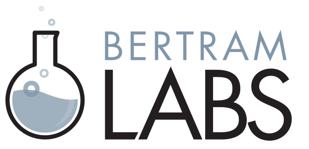

slidenumbers: true

# [fit] Introduction to Grails 3.1

### Presented by David Estes (@davydotcom) 



---

# What is Grails?

Grails 3 is "A powerful Groovy-based web application framework for the JVM". It is an MVC Based framework built on top of Spring Boot.

Provides a 'Convention-over-Configuration' approach to increase team productivity and get moving quickly.

---

# Whats new in Grails 3

* Gradle build system
* Built on top of spring-boot
* Application Profiles
* Groovy 2.4
* Lighter Weight
* Much much more

---

# Why Grails 3?

* Conventional frameworks make developer ramp up time quick
* Conventions dont restrict capabilities
* Spring Boot backing means all your spring-boot libraries work
* Convenient scripts for generating skeleton classes

---
# Why Grails 3? Continued...

* GORM
* Great RESTful API support
* Top Notch Asset Management (including support for LESS, SASS, Coffeescript, and more)
* Conventions remove the necessity for heavy Annotation use

---

# Profiles

Profiles are skeleton projects that can provide features and custom scripts for getting a project up and going

* Use web-api to do an api only based grails app (no views)
* Create an angular profile to quickly get going with angular js

---

# Getting Started

The easiest way to get started working on grails 3 is to use http://sdkman.io/ (formarly known as gvm)

```
sdk install grails 3.1.0.M2
grails create-app my-app
```

**Note**: Windows users can look into using posh-gvm

---

# Project Structure

* Domain Classes: `grails-app/domains`
* Controllers: `grails-app/controllers`
* Services: `grails-app/services`
* Views: `grails-app/views`
* Assets: `grails-app/assets`
* Tests: `src/test`

---

# Workshop

We are going to create a web app with hacker news like functionality in Grails 3.

[https://github.com/davydotcom/grails-news-workshop](https://github.com/davydotcom/grails-news-workshop)

Tests are located in `src/test` and `src/integration-test`. They can be run by typing `grails test-app`

Split into 4 labs by branches

---

# Part 1 (branch lab01)

This part of the workshop focuses on setting up our Post domain class and verifying our initial properties are configured

[https://grails.github.io/grails-doc/3.0.x/guide/GORM.html#domainClasses](https://grails.github.io/grails-doc/3.0.x/guide/GORM.html#domainClasses)

---

# Part 2 (branch lab02)

Now we will build on our domain class by setting up a Controller to get a list of Posts as well as actions for submitting new posts (views will be provided for this one)

---

# Part 3 (branch lab03)

Implementing security is often overlooked in these workshops. We are going to setup `spring-security` as well as show you how to tie a user to a submitted post. 

**Note:** Creating a view will be introduced as well as Geb tests

---

# Part 4 (branch lab04)

Leverage Services to create methods for calculating the score of a Post for ranking purposes. We will also see how Quartz can be setup to periodically refresh these scores.

---

# Part 5 (branch lab05) Deployment

This part of the lab will discuss how to deploy grails 3 based applications as well as talk about tieing to real data sources

---

# Resources

* Grails Website: [http://grails.org](http://grails.org)
* Grails Plugins Repo: [http://bintray.com/grails/plugins](http://bintray.com/grails/plugins)
* Grails Slack Community: [https://grails.slack.com/](https://grails.slack.com/)
* Morpheus Cloud Management: [https://www.gomorpheus.com](https://www.gomorpheus.com)